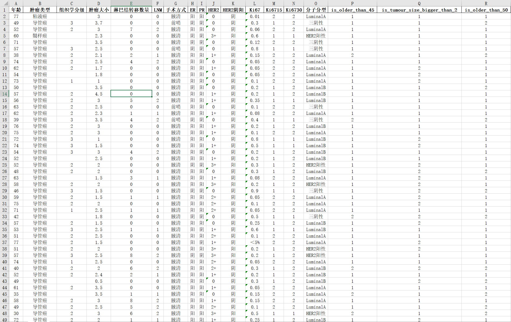

# Predicting Axillary Lymph Node Metastasis in Early Breast Cancer Using Deep Learning on Primary Tumor Biopsy Slides

This repo is the official implementation of our paper "Predicting Axillary Lymph Node Metastasis in Early Breast Cancer Using Deep Learning on Primary Tumor Biopsy Slides".

Our paper is accepted by [Frontiers in Oncology](https://www.frontiersin.org/articles/10.3389/fonc.2021.759007/full), and you can also get access our paper from [MedRxiv](https://www.medrxiv.org/content/10.1101/2021.10.10.21264721).

## Pre-Trained Models

[Model Checkpoints](https://drive.google.com/drive/folders/1W7kBL_kdzFuPS5jvI-liHCIe6YVl505z?usp=sharing)

## Data

### WSI Samples

#### N0


#### N+(1~2)


#### N+(>2)


### Clinical Data Samples



## Demo Software

[Download Link](https://drive.google.com/drive/folders/1ItKCldu8vbHhbZvhXic-11Ei-NVGBZU2?usp=sharing)

## Citation

Please cite our paper in your publications if it helps your research.

```
@article{xu2021predicting,
  title={Predicting Axillary Lymph Node Metastasis in Early Breast Cancer Using Deep Learning on Primary Tumor Biopsy Slides},
  author={Xu, Feng and Zhu, Chuang and Tang, Wenqi and Wang, Ying and Zhang, Yu and Li, Jie and Jiang, Hongchuan and Shi, Zhongyue and Liu, Jun and Jin, Mulan},
  journal={Frontiers in Oncology},
  pages={4133},
  year={2021},
  publisher={Frontiers}
}
```

## License

This BALNMP Dataset is made freely available to academic and non-academic entities for non-commercial purposes such as academic research, teaching, scientific publications, or personal experimentation. Permission is granted to use the data given that you agree to our license terms bellow:

1. That you include a reference to the BALNMP Dataset in any work that makes use of the dataset. For research papers, cite our preferred publication as listed on our website; for other media cite our preferred publication as listed on our website or link to the BALNMP website.
2. That you do not distribute this dataset or modified versions. It is permissible to distribute derivative works in as far as they are abstract representations of this dataset (such as models trained on it or additional annotations that do not directly include any of our data).
3. That you may not use the dataset or any derivative work for commercial purposes as, for example, licensing or selling the data, or using the data with a purpose to procure a commercial gain.
4. That all rights not expressly granted to you are reserved by us.

## Contact

- email: tangwenqi@bupt.edu.cn, czhu@bupt.edu.cn,drxufeng@mail.ccmu.edu.cn
