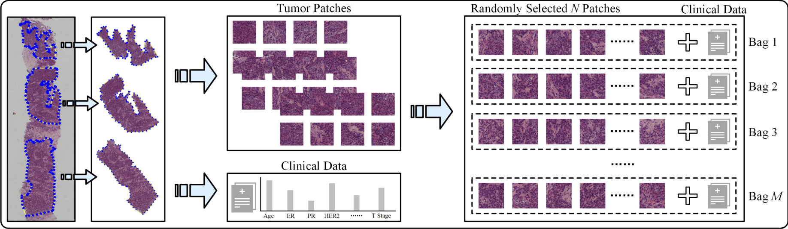
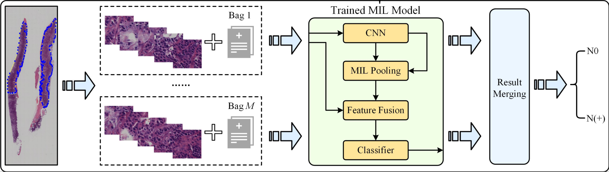
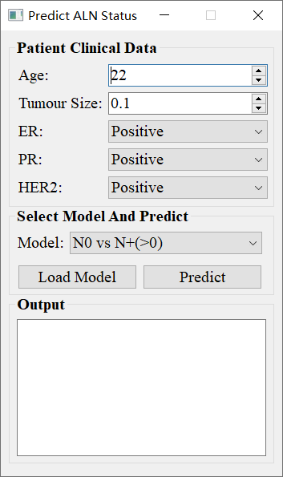

# Predicting Axillary Lymph Node Metastasis in Early Breast Cancer Using Deep Learning on Primary Tumor Biopsy Slides 
[Grand-Challenge](https://bcnb.grand-challenge.org/) | [Arxiv](https://arxiv.org/abs/2112.02222) | [Dataset Page](https://bupt-ai-cz.github.io/BCNB/) | [](https://twitter.com/intent/tweet?text=Codes%20and%20Data%20for%20Our%20Paper:%20"Predicting%20Axillary%20Lymph%20Node%20Metastasis%20in%20Early%20Breast%20Cancer"%20&url=https://github.com/bupt-ai-cz/BALNMP)

This repo is the official implementation of our paper "Predicting Axillary Lymph Node Metastasis in Early Breast Cancer Using Deep Learning on Primary Tumor Biopsy Slides".

Our paper is accepted by [Frontiers in Oncology](https://www.frontiersin.org/articles/10.3389/fonc.2021.759007/full), and you can also get access our paper from [Arxiv](https://arxiv.org/abs/2112.02222) or [MedRxiv](https://www.medrxiv.org/content/10.1101/2021.10.10.21264721).

## News
- We launched a [Grand Challenge: BCNB](https://bcnb.grand-challenge.org/) to promote relevant research.
- We released our data. Please visit [homepage](https://bupt-ai-cz.github.io/BCNB/) to get the downloading information.
- Paper codes are released, please see [code](./code) for more details.

## Abstract

- Objectives: To develop and validate a deep learning (DL)-based primary tumor biopsy signature for predicting axillary lymph node (ALN) metastasis preoperatively in early breast cancer (EBC) patients with clinically negative ALN.

- Methods: A total of 1,058 EBC patients with pathologically confirmed ALN status were enrolled from May 2010 to August 2020. A DL core-needle biopsy (DL-CNB) model was built on the attention-based multiple instance-learning (AMIL) framework to predict ALN status utilizing the DL features, which were extracted from the cancer areas of digitized whole-slide images (WSIs) of breast CNB specimens annotated by two pathologists. Accuracy, sensitivity, specificity, receiver operating characteristic (ROC) curves, and areas under the ROC curve (AUCs) were analyzed to evaluate our model.

- Results: The best-performing DL-CNB model with VGG16_BN as the feature extractor achieved an AUC of 0.816 (95% confidence interval (CI): 0.758, 0.865) in predicting positive ALN metastasis in the independent test cohort. Furthermore, our model incorporating the clinical data, which was called DL-CNB+C, yielded the best accuracy of 0.831 (95% CI: 0.775, 0.878), especially for patients younger than 50 years (AUC: 0.918, 95% CI: 0.825, 0.971). The interpretation of DL-CNB model showed that the top signatures most predictive of ALN metastasis were characterized by the nucleus features including density (*p* = 0.015), circumference (*p* = 0.009), circularity (*p* = 0.010), and orientation (*p* = 0.012).

- Conclusion: Our study provides a novel DL-based biomarker on primary tumor CNB slides to predict the metastatic status of ALN preoperatively for patients with EBC.

## Setup

### Clone this repo

```bash
git clone https://github.com/bupt-ai-cz/BALNMP.git
```

### Environment

Create environment and install dependencies.

```bash
conda create -n BALNMP python=3.6 -y
conda activate BALNMP
pip install -r code/requirements.txt
```

### Dataset

For your convenience, we have provided preprocessed clinical data in `code/dataset`, please download the processed WSI patches from [here](https://drive.google.com/file/d/1wY5KIVixdwzZZq2m0IoqmBLp0YlwBAz6/view?usp=sharing) and unzip them by the following scripts:

```bash
cd code/dataset
# download paper_patches.zip
unzip paper_patches.zip
```

## Training

Our codes have supported the following experiments, whose results have been presented in our [paper and supplementary material](https://arxiv.org/abs/2112.02222).

> experiment_index:
> 
> 0. N0 vs N+(>0)
> 1. N+(1-2) vs N+(>2)
> 2. N0 vs N+(1-2) vs N+(>2)
> 3. N0 vs N+(1-2)
> 4. N0 vs N+(>2)

To run any experiment, you can do as this:

```bash
cd code
bash run.sh ${experiment_index}
```

Furthermore, if you want to try other settings, please see `train.py` for more details.

## Paper results

The results in our paper are computed based on the [cut-off value in ROC](https://en.wikipedia.org/wiki/Youden%27s_J_statistic#:~:text=Youden%27s%20index%20is,as%20informedness.%5B3%5D). For your convenient reference, we have recomputed the classification results with argmax prediction rule, where the threshold for binary classification is 0.5, and the detailed recomputed results are [here](./recompute_results.md).

### The performance in prediction of ALN status (N0 vs. N(+))

<div align="center">
    
</div>

### The performance in prediction of ALN status (N0 vs. N + (1-2))

<div align="center">
    
</div>

### The performance in prediction of ALN status (N0 vs. N + (>2))

<div align="center">
    
</div>

## Implementation details

### Data preparation

In our all experiments, the patch number (*N*) of each bag is fixed as 10, however, the bag number (*M*) for each WSI is not fixed and is dependent on the resolution of a WSI. According to our statistical results, the bag number (*M*) of WSIs varies from 1 to 300, which is not fixed for a WSI during training and testing. The process of dataset preparation is shown in the following figure, and the details are as follows:

- Firstly, we cut out annotated tumor regions for each WSI, and there may exist multiple annotated tumor regions in a WSI.

- Then, each extracted tumor region is cropped into amounts of non-overlapping square patches with a resolution of 256 \* 256, and patches with a blank ratio greater than 0.3 are filtered out.

- Finally, for each WSI, a bag is composed of randomly sampled 10 (*N*) patches, and the left patches which can not be grouped into a bag will be discarded.

The 5 clinical characteristics used in our experiments are age (numerical), tumor size (numerical), ER (categorical), PR (categorical), and HER2 (categorical), which are provided in our BCNB Dataset, and you can access them from our [BCNB Dataset](https://bupt-ai-cz.github.io/BCNB/).

<div align="center">
    
</div>

### Model testing

As mentioned above, a WSI is split into multiple bags, and each bag is inputted into the MIL model to obtain predicted probabilities. So for obtaining the comprehensive predicted results of a WSI during testing, we compute the average predicted probabilities of all bags to achieve "Result Merging".

<div align="center">
    
</div>

## Demo software

We have also provided software for easily checking the performance of our model to predict ALN metastasis.

Please download the software from [here](https://drive.google.com/drive/folders/18f0rEmV3dfdZsnFY2mfbF-MMtk9JkjZY?usp=sharing), and check the `README.txt` for usage. Please note that this software is only used for demo, and it cannot be used for other purposes.

<div align="center">
    
</div>

## Citation

If this work helps your research, please cite this paper in your publications.

```
@article{xu2021predicting,
  title={Predicting axillary lymph node metastasis in early breast cancer using deep learning on primary tumor biopsy slides},
  author={Xu, Feng and Zhu, Chuang and Tang, Wenqi and Wang, Ying and Zhang, Yu and Li, Jie and Jiang, Hongchuan and Shi, Zhongyue and Liu, Jun and Jin, Mulan},
  journal={Frontiers in oncology},
  volume={11},
  pages={759007},
  year={2021},
  publisher={Frontiers Media SA}
}
```

## Contact

If you encounter any problems, please open an issue without hesitation, and you can also contact us with the following:

- email: tangwenqi@bupt.edu.cn, czhu@bupt.edu.cn, drxufeng@mail.ccmu.edu.cn

## Acknowledgements

This project is based on the following open-source projects. We thank their authors for making the source code publically available.

- [AttentionDeepMIL](https://github.com/AMLab-Amsterdam/AttentionDeepMIL)