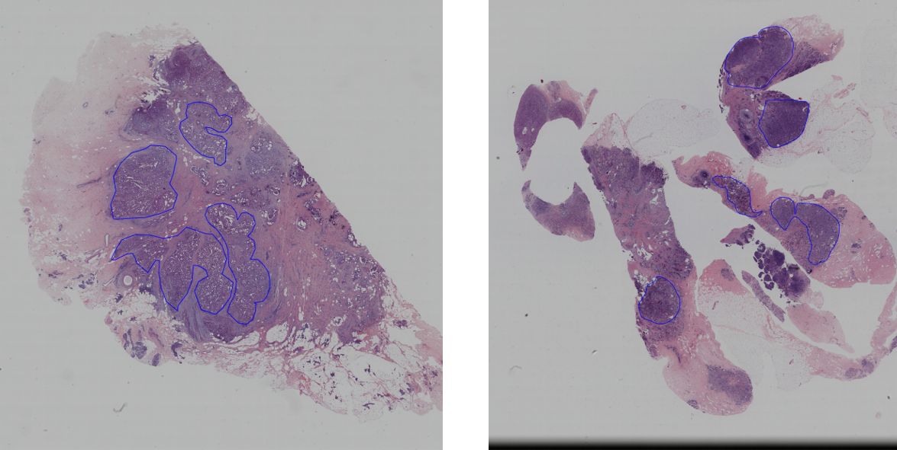
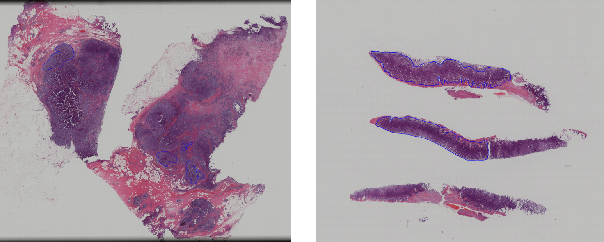
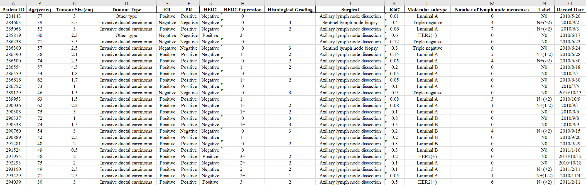

# Predicting Axillary Lymph Node Metastasis in Early Breast Cancer Using Deep Learning on Primary Tumor Biopsy Slides
[Project](https://bupt-ai-cz.github.io/BALNMP/) | [](https://twitter.com/intent/tweet?text=Codes%20and%20Data%20for%20Our%20Paper:%20"Predicting%20Axillary%20Lymph%20Node%20Metastasis%20in%20Early%20Breast%20Cancer"%20&url=https://github.com/bupt-ai-cz/BALNMP)


This repo is the official implementation of our paper "Predicting Axillary Lymph Node Metastasis in Early Breast Cancer Using Deep Learning on Primary Tumor Biopsy Slides".

Our paper is accepted by [Frontiers in Oncology](https://www.frontiersin.org/articles/10.3389/fonc.2021.759007/full), and you can also get access our paper from [MedRxiv](https://www.medrxiv.org/content/10.1101/2021.10.10.21264721).

## Abstract

- Objectives: To develop and validate a deep learning (DL)-based primary tumor biopsy signature for predicting axillary lymph node (ALN) metastasis preoperatively in early breast cancer (EBC) patients with clinically negative ALN.

- Methods: A total of 1,058 EBC patients with pathologically confirmed ALN status were enrolled from May 2010 to August 2020. A DL core-needle biopsy (DL-CNB) model was built on the attention-based multiple instance-learning (AMIL) framework to predict ALN status utilizing the DL features, which were extracted from the cancer areas of digitized whole-slide images (WSIs) of breast CNB specimens annotated by two pathologists. Accuracy, sensitivity, specificity, receiver operating characteristic (ROC) curves, and areas under the ROC curve (AUCs) were analyzed to evaluate our model.

- Results: The best-performing DL-CNB model with VGG16_BN as the feature extractor achieved an AUC of 0.816 (95% confidence interval (CI): 0.758, 0.865) in predicting positive ALN metastasis in the independent test cohort. Furthermore, our model incorporating the clinical data, which was called DL-CNB+C, yielded the best accuracy of 0.831 (95% CI: 0.775, 0.878), especially for patients younger than 50 years (AUC: 0.918, 95% CI: 0.825, 0.971). The interpretation of DL-CNB model showed that the top signatures most predictive of ALN metastasis were characterized by the nucleus features including density (*p* = 0.015), circumference (*p* = 0.009), circularity (*p* = 0.010), and orientation (*p* = 0.012).

- Conclusion: Our study provides a novel DL-based biomarker on primary tumor CNB slides to predict the metastatic status of ALN preoperatively for patients with EBC.

## Data

Our data includes whole slide images (WSIs) of breast cancer patients and the corresponding clinical data. According to the axillary lymph node (ALN) metastasis, 1058 patients are divided into the following 3 categories:

- N0: having no positive lymph nodes (655 patients, 61.9%).
- N+(1~2): having one or two positive lymph nodes (210 patients, 19.8%).
- N+(>2): having three or more positive lymph nodes (193 patients, 18.3%).

Here we have provided some WSI samples and clinical data samples, you can review our paper for more details. 

For full access to the BALNMP Dataset, please contact us and the usage of BALNMP Dataset must follow the license.

### WSI samples

#### N0



#### N+(1~2)



#### N+(>2)


### Clinical Data Samples




## Pre-Trained Models

Please download pre-trained models from [here](https://drive.google.com/drive/folders/1W7kBL_kdzFuPS5jvI-liHCIe6YVl505z?usp=sharing).

## Demo Software

We have also provided software for easily checking the performance of our model to predict ALN metastasis.

Please download the software from [here](https://drive.google.com/drive/folders/1ItKCldu8vbHhbZvhXic-11Ei-NVGBZU2?usp=sharing), and check the `README.txt` for usage. Please note that this software is only used for demo, and it cannot be used for other purposes.


## Citation

Please cite our paper in your publications if it helps your research.

```
@article{xu2021predicting,
  title={Predicting Axillary Lymph Node Metastasis in Early Breast Cancer Using Deep Learning on Primary Tumor Biopsy Slides},
  author={Xu, Feng and Zhu, Chuang and Tang, Wenqi and Wang, Ying and Zhang, Yu and Li, Jie and Jiang, Hongchuan and Shi, Zhongyue and Liu, Jun and Jin, Mulan},
  journal={Frontiers in Oncology},
  pages={4133},
  year={2021},
  publisher={Frontiers}
}
```

## License

This BALNMP Dataset is made freely available to academic and non-academic entities for non-commercial purposes such as academic research, teaching, scientific publications, or personal experimentation. Permission is granted to use the data given that you agree to our license terms bellow:

1. That you include a reference to the BALNMP Dataset in any work that makes use of the dataset. For research papers, cite our preferred publication as listed on our website; for other media cite our preferred publication as listed on our website or link to the BALNMP website.
2. That you do not distribute this dataset or modified versions. It is permissible to distribute derivative works in as far as they are abstract representations of this dataset (such as models trained on it or additional annotations that do not directly include any of our data).
3. That you may not use the dataset or any derivative work for commercial purposes as, for example, licensing or selling the data, or using the data with a purpose to procure a commercial gain.
4. That all rights not expressly granted to you are reserved by us.

## Contact

- email: tangwenqi@bupt.edu.cn, czhu@bupt.edu.cn, drxufeng@mail.ccmu.edu.cn
