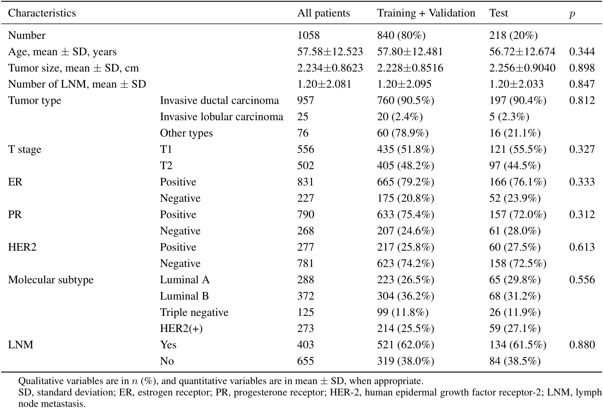
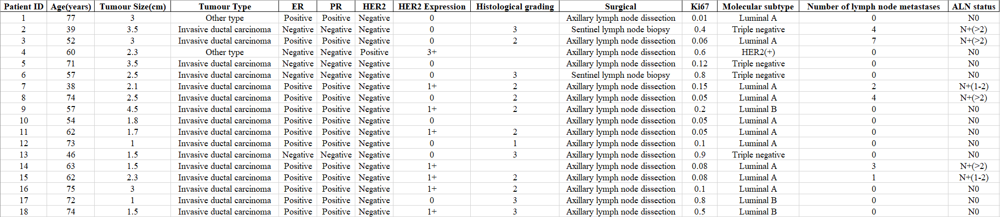

# Predicting Axillary Lymph Node Metastasis in Early Breast Cancer Using Deep Learning on Primary Tumor Biopsy Slides 
[Grand-Challenge](https://bcnb.grand-challenge.org/) | [Arxiv](https://arxiv.org/abs/2112.02222) | [Dataset Page](https://bupt-ai-cz.github.io/BCNB/) | [](https://twitter.com/intent/tweet?text=Codes%20and%20Data%20for%20Our%20Paper:%20"Predicting%20Axillary%20Lymph%20Node%20Metastasis%20in%20Early%20Breast%20Cancer"%20&url=https://github.com/bupt-ai-cz/BALNMP)

This repo is the official implementation and dataset introduction of our paper "Predicting Axillary Lymph Node Metastasis in Early Breast Cancer Using Deep Learning on Primary Tumor Biopsy Slides".

Our paper is accepted by [Frontiers in Oncology](https://www.frontiersin.org/articles/10.3389/fonc.2021.759007/full), and you can also get access our paper from [Arxiv](https://arxiv.org/abs/2112.02222) or [MedRxiv](https://www.medrxiv.org/content/10.1101/2021.10.10.21264721).

## News
- We launched a [Grand Challenge: BCNB](https://bcnb.grand-challenge.org/) to promote relevant research.
-  We released our data. Please visit [homepage](https://bupt-ai-cz.github.io/BCNB/) to get the downloading information. 

## Abstract

- Objectives: To develop and validate a deep learning (DL)-based primary tumor biopsy signature for predicting axillary lymph node (ALN) metastasis preoperatively in early breast cancer (EBC) patients with clinically negative ALN.

- Methods: A total of 1,058 EBC patients with pathologically confirmed ALN status were enrolled from May 2010 to August 2020. A DL core-needle biopsy (DL-CNB) model was built on the attention-based multiple instance-learning (AMIL) framework to predict ALN status utilizing the DL features, which were extracted from the cancer areas of digitized whole-slide images (WSIs) of breast CNB specimens annotated by two pathologists. Accuracy, sensitivity, specificity, receiver operating characteristic (ROC) curves, and areas under the ROC curve (AUCs) were analyzed to evaluate our model.

- Results: The best-performing DL-CNB model with VGG16_BN as the feature extractor achieved an AUC of 0.816 (95% confidence interval (CI): 0.758, 0.865) in predicting positive ALN metastasis in the independent test cohort. Furthermore, our model incorporating the clinical data, which was called DL-CNB+C, yielded the best accuracy of 0.831 (95% CI: 0.775, 0.878), especially for patients younger than 50 years (AUC: 0.918, 95% CI: 0.825, 0.971). The interpretation of DL-CNB model showed that the top signatures most predictive of ALN metastasis were characterized by the nucleus features including density (*p* = 0.015), circumference (*p* = 0.009), circularity (*p* = 0.010), and orientation (*p* = 0.012).

- Conclusion: Our study provides a novel DL-based biomarker on primary tumor CNB slides to predict the metastatic status of ALN preoperatively for patients with EBC.

## Paper results

The results in our paper are computed based on the [cut-off value in ROC](https://en.wikipedia.org/wiki/Youden%27s_J_statistic#:~:text=Youden%27s%20index%20is,as%20informedness.%5B3%5D). For your convenient reference, we have recomputed the classification results with argmax prediction rule, where the threshold for binary classification is 0.5, and the detailed recomputed results are [here](./recompute_results.md).

### The performance in prediction of ALN status (N0 vs. N(+))

<div align="center">
    
</div>

### The performance in prediction of ALN status (N0 vs. N + (1-2))

<div align="center">
    
</div>

### The performance in prediction of ALN status (N0 vs. N + (>2))

<div align="center">
    
</div>

## Implementation details

### Data preparation

In our all experiments, the patch number (*N*) of each bag is fixed as 10, however, the bag number (*M*) for each WSI is not fixed and is dependent on the resolution of a WSI. According to our statistical results, the bag number (*M*) of WSIs varies from 1 to 300, which is not fixed for a WSI during training and testing. The process of dataset preparation is shown in the following figure, and the details are as follows:

- Firstly, we cut out annotated tumor regions for each WSI, and there may exist multiple annotated tumor regions in a WSI.

- Then, each extracted tumor region is cropped into amounts of non-overlapping square patches with a resolution of 256 \* 256, and patches with a blank ratio greater than 0.3 are filtered out.

- Finally, for each WSI, a bag is composed of randomly sampled 10 (*N*) patches, and the left patches which can not be grouped into a bag will be discarded.

The 5 clinical characteristics used in our experiments are age (numerical), tumor size (numerical), ER (categorical), PR (categorical), and HER2 (categorical), which are provided in our BCNB Dataset, and you can access them from our [BCNB Dataset](https://bupt-ai-cz.github.io/BCNB/).

<div align="center">
    
</div>

### Model testing

As mentioned above, a WSI is split into multiple bags, and each bag is inputted into the MIL model to obtain predicted probabilities. So for obtaining the comprehensive predicted results of a WSI during testing, we compute the average predicted probabilities of all bags to achieve "Result Merging".

<div align="center">
    
</div>

## Model code and pre-trained model

We have provided the [model code](./model.py) and [pre-trained model](https://drive.google.com/drive/folders/1W7kBL_kdzFuPS5jvI-liHCIe6YVl505z?usp=sharing) for inference, the code is heavily borrowed from [AttentionDeepMIL](https://github.com/AMLab-Amsterdam/AttentionDeepMIL), which is implemented with [Pytorch](https://pytorch.org/).

## Demo software

We have also provided software for easily checking the performance of our model to predict ALN metastasis.

Please download the software from [here](https://drive.google.com/drive/folders/18f0rEmV3dfdZsnFY2mfbF-MMtk9JkjZY?usp=sharing), and check the `README.txt` for usage. Please note that this software is only used for demo, and it cannot be used for other purposes.

<div align="center">
    
</div>

# BCNB Dataset

Our paper has introduced a new dataset of **Early Breast Cancer Core-Needle Biopsy WSI (BCNB)**, which includes core-needle biopsy whole slide images (WSIs) of early breast cancer patients and the corresponding clinical data. The WSIs have been examined and annotated by two independent and experienced pathologists blinded to all patient-related information.

Based on this dataset, we have studied the deep learning algorithm for predicting the metastatic status of axillary lymph node (ALN) preoperatively by using multiple instance learning (MIL), and have achieved the best AUC of 0.831 in the independent test cohort. For more details, please review our [paper](https://arxiv.org/abs/2112.02222).

<div align="center">
    <a href="https://bupt-ai-cz.github.io/BCNB/">
        
    </a>
</div>

## Download

For full access to the BCNB dataset, please visit the [Dataset Page](https://bupt-ai-cz.github.io/BCNB/).

## Description

**There are WSIs of 1058 patients, and only part of tumor regions are annotated in WSIs. Except for the WSIs, we have also provided the clinical characteristics of each patient, which includes age, tumor size, tumor type, ER, PR, HER2, HER2 expression, histological grading, surgical, Ki67, molecular subtype, number of lymph node metastases, and the metastatic status of ALN. The dataset has been desensitized, and not contained the privacy information of patients.** 

The slides were scanned with Iscan Coreo pathologic scanner, and the WSIs were viewed at 200x magnification using Image Viewer software.

The WSIs are provided with `.jpg` format and the clinical data are provided with `.xlsx` format. The dataset is collected and organized by the experienced doctors of our research group. The dataset has been desensitized, and not contained the privacy information of patients.

Based on this dataset, we have studied the prediction of the metastatic status of axillary lymph node (ALN) in our [paper](https://arxiv.org/abs/2112.02222), which is a weakly supervised classification task. However, other researches based on our dataset are also feasible, such as the prediction of histological grading, molecular subtype, HER2, ER, and PR. We do not limit the specific content for your research, and any research based on our dataset is welcome.

**Please note that the dataset is only used for education and research, and the usage for commercial and clinical applications is not allowed. The usage of this dataset must follow the [license](https://github.com/bupt-ai-cz/BALNMP#license).** 

## Annotation

Annotation information is stored in `.json` with the following format, where `vertices` have recorded coordinates of each point in the polygonal annotated area.

```json
{
    "positive": [
        {
            "name": "Annotation 0",
            "vertices": [
                [
                    14274,
                    10723
                ],
                [
                    14259,
                    10657
                ],
                ......
            ]
        }
    ],
    "negative": []
}
```

## Code for data preprocessing

We provide some codes for data preprocessing, which can be used to extract annotated tumor regions of all WSIs, and cutting patches with fixed size from all extracted annotated tumor regions, they may be helpful for you. Please check the [code](./code_preprocessing) for more details.

## Overview

For your convenience in research, we have split the BCNB Dataset into training cohort, validation cohort, and independent test cohort with the ratio as 6: 2: 2. The overall clinical characteristics statistics information of the BCNB Dataset are as follows:

<div align="center">
    
</div>

### WSIs

<div align="center">
    
</div>

<div align="center">
    
</div>

<div align="center">
    2)" height="50%" width="50%" />
</div>

### Clinical data

<div align="center">
    
</div>

## Citation

Please cite our paper in your publications if it helps your research.

```
@article{xu2021predicting,
  title={Predicting Axillary Lymph Node Metastasis in Early Breast Cancer Using Deep Learning on Primary Tumor Biopsy Slides},
  author={Xu, Feng and Zhu, Chuang and Tang, Wenqi and Wang, Ying and Zhang, Yu and Li, Jie and Jiang, Hongchuan and Shi, Zhongyue and Liu, Jun and Jin, Mulan},
  journal={Frontiers in Oncology},
  pages={4133},
  year={2021},
  publisher={Frontiers}
}
```

## License

This dataset is made freely available to academic and non-academic entities for non-commercial purposes such as academic research, teaching, scientific publications, or personal experimentation. Permission is granted to use the data given that you agree to our license terms bellow:

1. That you include a reference to the dataset in any work that makes use of the dataset. For research papers, cite our preferred publication as listed on our website; for other media cite our preferred publication as listed on our website or link to the website.
2. That you do not distribute this dataset or modified versions. It is permissible to distribute derivative works in as far as they are abstract representations of this dataset (such as models trained on it or additional annotations that do not directly include any of our data).
3. That you may not use the dataset or any derivative work for commercial purposes as, for example, licensing or selling the data, or using the data with a purpose to procure a commercial gain.
4. That all rights not expressly granted to you are reserved by us.

## Contact

If you encounter any problems please contact us without hesitation.

- email: tangwenqi@bupt.edu.cn, czhu@bupt.edu.cn, drxufeng@mail.ccmu.edu.cn
